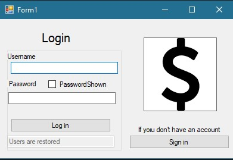
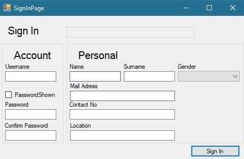
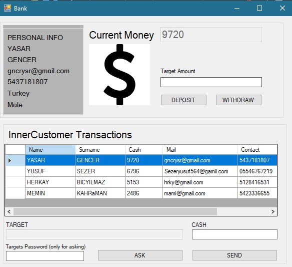
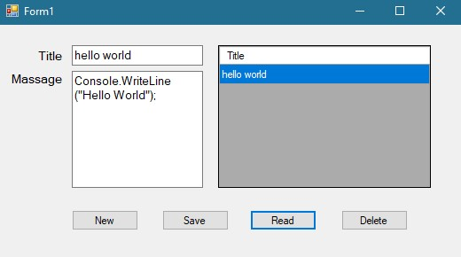

# Some clone applications i made while i learn .net

There is a few apps i maade to learn .net programming.

## ATM Sim

### APP Summary
Basic atm simulation made with c# in roughly 4 - 5 hours.

Currently saves users in text file.

### IMAGES

# Calculator

### APP Summary
Basic calculator app with only 4 operations made with c# in roughly 1 - 2 hours.

### IMAGES

# NotePad

### APP Summary
Basic notepad simulation made with c# in roughly .5 - 1 hours.

### IMAGES

