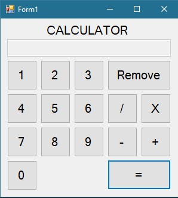

# Some clone applications i made while i learn .net

There is a few apps i maade to learn .net programming.

<h1 align="center">ATM Sim</h1>

    
    Basic atm simulation made with c# in roughly 4 - 5 hours. 

    User can log in or sign in if they don't have an account. After user log in to their account they can withdraw or deposit money to their account. User can interact with other users. They can send other users money or take money from them. If user wants to take money from other accounts they must know other account's password.

    Currently saves users in text file.

<h2 align="center">Images</h1>

<h1 align="center">Calculatır</h1>

    Basic calculator app with only 4 operations made with c# in roughly 1 - 2 hours.

<h2 align="center">Images</h1>

<h1 align="center">NotePad</h1>

    Basic notepad simulation made with c# in roughly .5 - 1 hours.

<h2 align="center">Images</h1>

